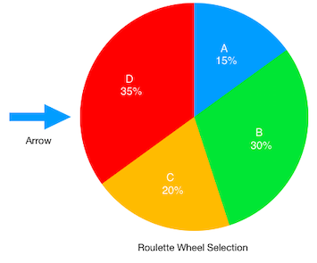
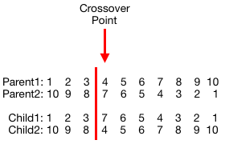
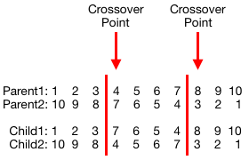
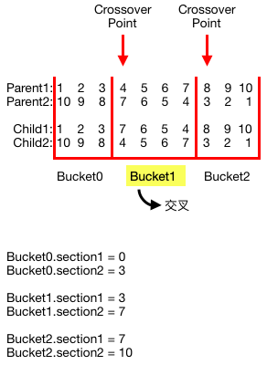

## using GA solve knapsack problem

### Problem:
* 有 10 種不同的物品 A~J，每種物品各有10個
* 背包最大容量 275

| Item  | A | B | C | D | E | F | G | H | I | J |
| ----- |---|---|---|---|---|---|---|---|---|---|
| Weight| 1 | 2 | 3 | 4 | 5 | 6 | 7 | 8 | 9 |10 |
| Value | 6 | 7 | 8 | 9 |10 |11 |12 |13 |14 |15 |


已知最佳解為

Total weight = 275 and value = 620

有多種取法，例如：A~F 各取10個、G 取 8個、I 取 1個


---

### Program

GA.h & GA.cpp: 運算基因演算法之主要程式。

Statistic.h & Statistic.cpp: 用於統計執行 GA 數回合的結果。 


---


### Encoding

每個個體有以下 data：
 * int gene[GENE_LENGTH];
 * int weight;
 * int value;
 * int fitness;

**GENE_LENGTH** 為 10 個 bit，其中
 * 每個 bit 之編碼範圍 ∈ **[0,10]**
 * gene[0] - gene[9] 表示 item 'A' - 'J' 所取的數量。


---
 
 
### Fitness

一般未發生 overweight 時適應值為： `Fitness = Weight * Value`

但當背包超重時則需要一個懲罰係數來調整，原先採用的方式是：

`Fitness = Value - ALPHA * (Weight - KNAPSACK_SIZE)`，其中 ALPHA 為懲罰係數。

但此方法會造成某些個體的適應值為負數，若要採取 Roulette wheel selection 時必須額外再作偏移處理，進而影響運算速度。
因此將懲罰係數改為 `Fitness * ALPHA`，其中 `ALPHA` 須和超重值相關。

因此將計算方式改為：

`Fitness = Value * (0.9 - ((Weight - KNAPSACK_SIZE) / (2 * KNAPSACK_SIZE)))`

其中 `(0.9 - ((Weight - KNAPSACK_SIZE) / (2 * KNAPSACK_SIZE))` 值域為 **[0.4, 0.89]**。

超重值 = 1 時， `Fitness ≈ Value * 0.89`；超重值 = 275 時， `Fitness = Value * 0.4`。


---


### Selection

#### Tournament Selection
步驟說明：
1. 從母群中隨機挑選兩條染色體來比較，將適應值較高者放入交配池中。
2. 重複 step 1 直到交配池數量等於母群。

#### Roulette Selection

每個個體被選擇的機率 `P = Fitness / Total Fitness`

計算出各自的機率後再建立一個 scope array，舉例說明：

假設有四個個體 A ~ D，其被選擇的機率 P 分別為 15%、30%、20%、35%

隨機產生一個箭頭 arrow ∈ [0, 99]
- arrow ∈ [0, 15) 表示箭頭指向 A
- arrow ∈ [15, 45) 表示箭頭指向 B
- arrow ∈ [45, 65) 表示箭頭指向 C
- arrow ∈ [65, 100) 表示箭頭指向 D
 
因此建立的 scope array = {15, 45, 65, 100}，當 arrow < scope[i] 時，表示選中第 i 個個體。




步驟說明：
1. 計算適應值總和
2. 計算每個個體被選中之機率，亦即其適應值之佔比
3. 建立 scope array
4. 隨機產生一個數 arrow ∈ [0, 99]，當 arrow < scope[i] 時，表示選中第 i 個個體
5. 重複 step 4 直到交配池數量等於母群。


---


### Crossover

#### Single-Point Crossover

從交配池中隨機挑兩個個體出來，接著隨機產生一個 crossover point ∈ [1, GENE_LENGTH - 1]，
從 crossover point 開始，將兩個基因序列作交叉。如圖所示：




#### K-Point Crossover

從交配池中隨機挑兩個個體出來，接著隨機產生 *K* 個不重複的 crossover points ∈ [1, GENE_LENGTH - 1]，
從 crossover point 開始，將兩個基因序列作交叉。
舉例說明：假設 `K = 2` 且 crossover point = {3, 7}，如圖所示：




為了讓 crossoverKP() 這個 function 可以兼容 K = 2 到 K = GENE_LENGTH - 1，
因此在作 crossover 之前，依據先前產生的 k 個 crossover points 建立一個 bucket array 作為區分基因序列是否要交叉。
偶數 bucket 不作 crossover；奇數 bucket 作 crossover。
示意圖如下：

 

每個 bucket 存有兩個 section 用作 for loop 的控制，
section1 作為起始條件；section2 作為終止條件。 


---


### Mutation

#### Single-Point Mutation

每個個體都有發生突變的機率，但只有隨機一個 bit 會突變。


#### Multiple-Point Mutation

每個個體都有發生突變的機率，且每個 bit 都有機率發生突變。


---


### Argument

##### GA.h
* **GENERATION:** 設定欲跑幾個世代, e.g., 100
* **POPULATION_SIZE:** 設定族群大小, e.g., 4
* **CROSSOVER_RATE:** 設定交配率(%), e.g., 50
* **MUTATION_RATE:** 設定突變率(%), e.g., 10
* **KNAPSACK_SIZE:** 背包大小（275）
* **GENE_LENGTH:** 基因長度（10）
* **DEBUG_MODE:**
    * 0: 不將執行過程的細節印出
    * 1: 將執行過程的細節印出
    
* **EACH_ROUND_RESULT:** 
    * 0: 不將每個回合的結果印出
    * 1: 將每個回合的結果印出
    
* **SELECTION_TYPE:** 
    * 0: 採用 Tournament Selection
    * 1: 採用 Roulette Wheel Selection
 
* **CROSSOVER_TYPE:**
    * 0: 採用 Single-Point Crossover
    * 1: 採用 K-Point Crossover
    
* **K_POINT_CROSSOVER:**
    * 當採用 K-Point Crossover 時，設定 K 的值，K ∈ [2, (GENE_LENGTH - 1)]

* **MUTATION_TYPE:**
    * 0: 採用 Single-Point Mutation
    * 1: 採用 Multiple-Point Mutation

##### Statistic.h
* **ROUND:** 設定欲跑幾個回合


---


### Result

經反覆測試，目前為止最佳的參數如下：
- Tournament Selection
- Single-Point Crossover
- Single-Point Mutation
- Generation: 500
- Population: 800
- Crossover rate: 50%
- Mutation rate: 50%

跑 100 回合找出最佳解的次數為 98 回合。

```
==================== STATISTIC ====================
Selection type: Tournament
Crossover type: Single-Point
Mutation type: Single-Point
Round: 100
Generation: 500
Population: 800
Crossover rate: 50%
Mutation rate: 50%

 Overweight count | Overweight rate | Best case weight | Avg. value | Best value | Best fitness |Best case count
                0 |          0.00 % |              275 |     619.90 |        620 |          620 |             98
Best case: A: 10  B: 10  C: 10  D: 10  E: 10  F: 10  G: 8  H: 0  I: 1  J: 0  
Time taken: 2373.68s
```  

跑一個回合的時間約為 23 秒

```
==================== STATISTIC ====================
Selection type: Tournament
Crossover type: Single-Point
Mutation type: Single-Point
Round: 1
Generation: 500
Population: 800
Crossover rate: 50%
Mutation rate: 50%

 Overweight count | Overweight rate | Best case weight | Avg. value | Best value | Best fitness |Best case count
                0 |          0.00 % |              275 |     620.00 |        620 |          620 |              1
Best case: A: 10  B: 10  C: 10  D: 10  E: 9  F: 10  G: 10  H: 0  I: 0  J: 0  
Time taken: 23.36s
```

若將族群數降低到 300，找出最佳解的回合剩下 64 回合，但執行時間縮短至約 8 秒

```
==================== STATISTIC ====================
Selection type: Tournament
Crossover type: Single-Point
Mutation type: Single-Point
Round: 100
Generation: 500
Population: 300
Crossover rate: 50%
Mutation rate: 50%

 Overweight count | Overweight rate | Best case weight | Avg. value | Best value | Best fitness |Best case count
                0 |          0.00 % |              275 |     618.56 |        620 |          620 |             64
Best case: A: 10  B: 10  C: 10  D: 10  E: 10  F: 9  G: 9  H: 1  I: 0  J: 0  
Time taken: 844.66s
```
